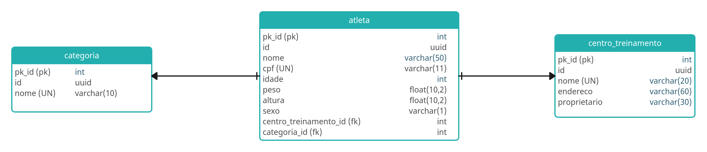

# Lab 05 - WorkoutAPI com FastAPI

Este projeto faz parte do **Bootcamp DIO - Back-end com Python** e tem como objetivo praticar o desenvolvimento de **APIs REST com FastAPI**, aplicando conceitos como **modelagem de dados**, **relacionamentos entre entidades**, **tratamento de exceções**, **paginação** e **customização de respostas**.

A **WorkoutAPI** é uma API de competição de CrossFit (sim 😄, unindo duas paixões: **codar e treinar**). Trata-se de um projeto **hands-on**, com uma modelagem simples, porém suficiente para aprender os principais recursos do **FastAPI**.

---

## 🧩 Desafio

O desafio consiste em **desenvolver e evoluir uma API REST** utilizando **FastAPI** e **SQLAlchemy**, seguindo uma **Modelagem de Entidade e Relacionamento (MER)**.

A API deve permitir o gerenciamento de atletas, centros de treinamento e categorias, aplicando boas práticas de desenvolvimento de APIs.

---

## 🗂️ Modelagem de Dados

O projeto utiliza uma **MER (Modelagem de Entidade e Relacionamento)** para representar as entidades principais do sistema, como:

- **Atleta**
- **Centro de Treinamento**
- **Categoria**

As relações entre essas entidades devem ser implementadas utilizando **SQLAlchemy ORM**.


---

## 🛠️ Funcionalidades

### Funcionalidades base:
- Cadastro de atletas
- Consulta de atletas
- Relacionamento entre atleta, centro de treinamento e categoria
- Persistência de dados utilizando banco relacional

---

### 🔥 Desafio Final

#### 1. Adicionar **Query Parameters** nos endpoints
- **Atleta**
  - `nome`
  - `cpf`

---

#### 2. Customizar o **response** de retorno dos endpoints

- **GET /atletas**
  - Retornar apenas:
    - `nome`
    - `centro_treinamento`
    - `categoria`

---

#### 3. Manipular exceções de integridade dos dados

- Tratar exceções do tipo:
  - `sqlalchemy.exc.IntegrityError`
- Retornar a mensagem:
  > **"Já existe um atleta cadastrado com o cpf: x"**
- Utilizar:
  - **status_code: 303**

---

#### 4. Adicionar paginação

- Utilizar a biblioteca:
  - **fastapi-pagination**
- Implementar:
  - `limit`
  - `offset`

---

## 🧠 Conceitos praticados

- **FastAPI**
- Criação de **APIs REST**
- **Modelagem de Entidade e Relacionamento (MER)**
- **SQLAlchemy ORM**
- **Query Parameters**
- **Customização de responses**
- **Tratamento de exceções**
- **Paginação de resultados**
- Organização do projeto em módulos

---

## 🚀 Como executar

1. Clone o repositório:
```bash
git clone https://github.com/alnbastos/labs_python_dio.git
```

2. Acesse o diretório do laboratório:
```bash
cd labs_python_dio/lab05_workout_api/
```

3. Ambiente virtual e dependências

Para executar o projeto, foi utilizado o **pyenv** com a versão **Python 3.12.1**, juntamente com o **Poetry** para gerenciamento do ambiente virtual e das dependências.

Instale o Poetry (caso ainda não tenha):
```bash
pip install poetry
```

4. Instale as dependências:
```bash
cd workout_api/
poetry install
```

5. Execute a aplicação:
```bash
uvicorn main:app --reload
```

6. Acesse a documentação interativa:

- Swagger UI: http://127.0.0.1:8000/docs
- Redoc: http://127.0.0.1:8000/redoc
