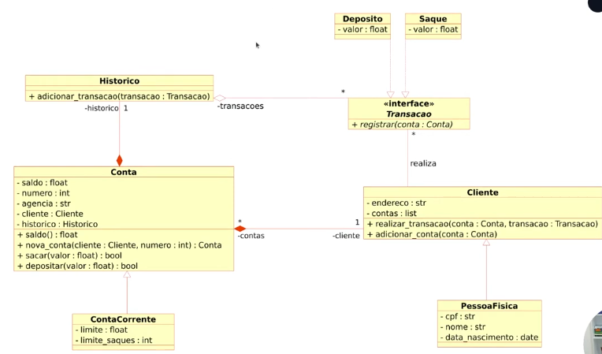

# Lab 08 - API Bancária Assíncrona com FastAPI

Este projeto faz parte do **Bootcamp DIO - Back-end com Python** e tem como objetivo praticar o desenvolvimento de **APIs RESTful modernas**, utilizando **FastAPI**, **programação assíncrona** e **boas práticas de design de APIs**, aplicadas a um contexto de **sistema bancário**.

---

## 🧩 Desafio

O desafio consiste em **projetar e implementar uma API bancária assíncrona**, responsável por gerenciar **depósitos**, **saques** e **consulta de extrato**, vinculados a **contas correntes**, garantindo **segurança** por meio de **autenticação JWT**.

A aplicação deve permitir que apenas usuários autenticados realizem operações sensíveis, seguindo regras de negócio básicas de um sistema bancário. Seguindo o modelo UML:



---

## 🛠️ Funcionalidades

### Funcionalidades principais:
- **Cadastro de transações**:
  - Depósitos
  - Saques
- **Exibição de extrato bancário**:
  - Listagem de todas as transações associadas a uma conta corrente
- **Autenticação e autorização**:
  - Proteção dos endpoints utilizando **JWT (JSON Web Token)**

---

## 📋 Regras de Negócio

- Não permitir **depósitos ou saques com valores negativos**
- Validar se a conta possui **saldo suficiente** antes de realizar um saque
- Garantir que transações estejam sempre vinculadas a uma **conta corrente válida**
- Restringir o acesso aos endpoints protegidos apenas a **usuários autenticados**

---

## 🧠 Conceitos praticados

- **FastAPI**
- Programação **assíncrona** com Python (`async` / `await`)
- Criação de **APIs RESTful**
- **Modelagem de dados**
- Relacionamento entre contas e transações
- **Autenticação e autorização com JWT**
- Validação de dados com **Pydantic**
- Documentação automática com **OpenAPI / Swagger**

---

## 🛠️ Tecnologias utilizadas

- Python 3
- FastAPI
- Pydantic
- JWT (JSON Web Token)
- Uvicorn

---

## 🚀 Como executar

1. Clone o repositório:
```bash
git clone https://github.com/alnbastos/labs_python_dio.git
```

2. Acesse o diretório do laboratório:
```bash
cd labs_python_dio/lab08_sistema_bancario_api/
```

3. Instale as dependências:
```bash
poetry install
```

4. Execute a aplicação:
```bash
task run
```

5. Acesse a documentação interativa:
Swagger UI: http://127.0.0.1:8000/docs

---

## 📖 Observação

Este laboratório tem caráter **educacional**, com foco no aprendizado de **FastAPI**, **APIs assíncronas** e **segurança com JWT**.  
A estrutura do projeto serve como base para evoluções futuras, como integração com banco de dados, controle de usuários mais robusto e novas regras de negócio bancárias.
